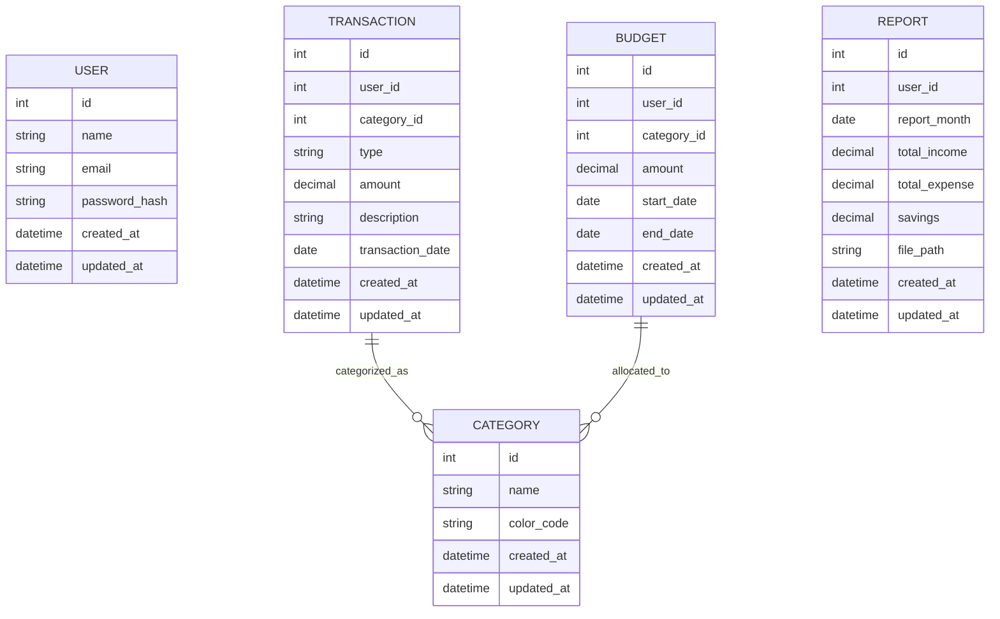
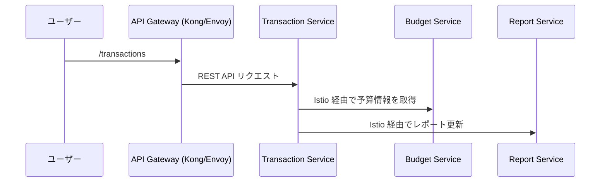
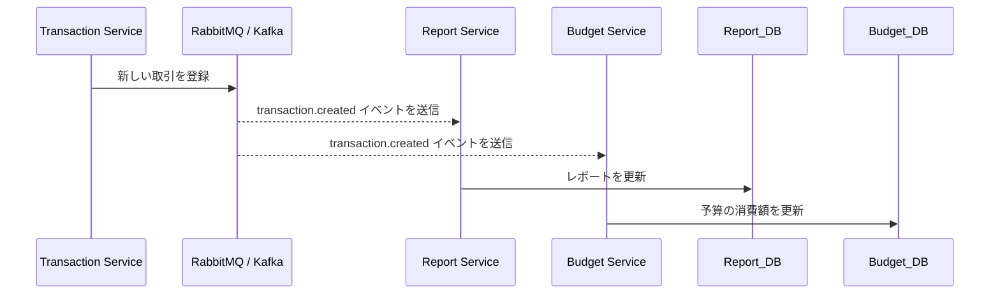
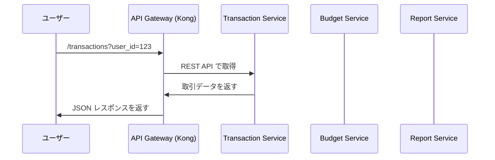
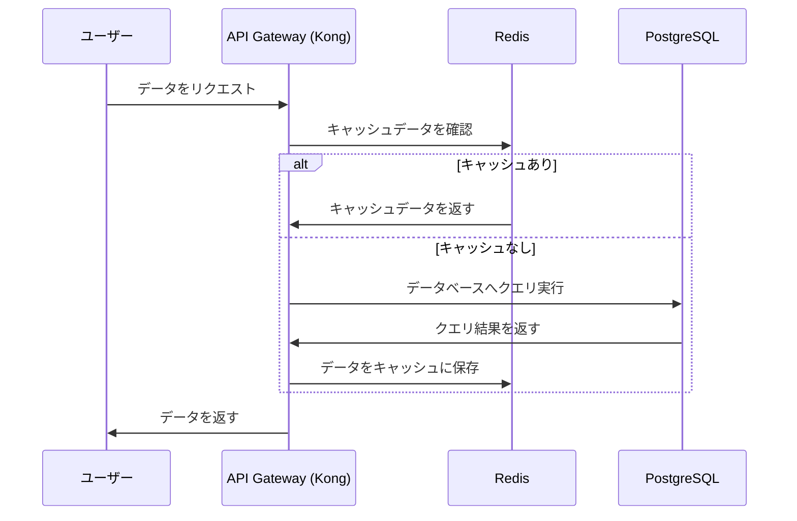
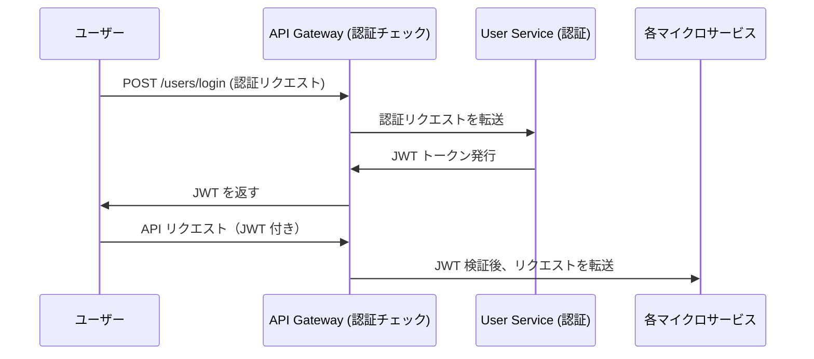
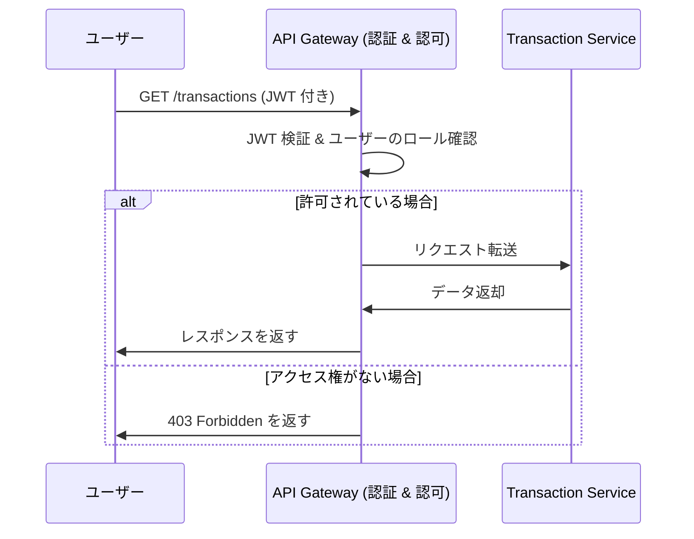

## 動作確認

### フロントエンド

```
http://localhost:3000
```
### API

```
http://localhost:8080
```

### Redmine

```
http://localhost:3100
```

### JENKINS

```
http://localhost:8081
```

# ✅ 家計簿アプリの機能開発順序(詳細はRedmine)

## 📌 フェーズ 1: 基盤構築（開発準備）
**目的:** 開発環境を整え、CI/CDを構築し、DB設計を完了する

### **🟢 1.1 ローカル開発環境の構築　済**
- [ ] **リポジトリ作成** (`backend`・`frontend`・`infra`)
- [ ] **Docker環境の準備** (`docker-compose.yml`)
- [ ] **開発環境のコンテナ作成** (`backend`・`frontend`・`db`・`jenkins`)
- [ ] **VSCode DevContainer の設定** (`.devcontainer.json`)
- [ ] **Redmineのセットアップ**（開発管理用）

### **🟡 1.2 CI/CD 環境の準備**
- [ ] **Jenkinsのセットアップ　済**（Dockerコンテナ構築）
- [ ] **バックエンドのCI/CDパイプライン**
- [ ] **フロントエンドのCI/CDパイプライン**
- [ ] **インフラ（Terraform）のCI/CDパイプライン**
- [ ] **`main` ブランチのマージ時にデプロイを実行する設定**

### **🟠 1.3 データベース設計**
- [ ] **ER図の作成**（ユーザー・収支・カテゴリ）
- [ ] **PostgreSQLのスキーマ作成**
- [ ] **マイグレーションの実装** (`go-migrate`)
- [ ] **初期データの投入**（カテゴリのプリセット）

### **🔵 1.4 インフラ環境の整備**
- [ ] **Azureリソースの設計** (`VNet`・`VM`・`SQL`・`Bastion`)
- [ ] **Terraform の初期設定** (`main.tf`・`variables.tf`)
- [ ] **Kubernetesクラスタの構築**（Azure Kubernetes Service）
- [ ] **Kubernetesマニフェスト作成**（`backend.yaml`・`frontend.yaml`）

---

## 📌 フェーズ 2: 認証機能
**目的:** ユーザー管理を実装し、アプリの基本認証を整備する
- [ ] **ユーザー登録 & ログイン**
- [ ] **JWT認証の実装**
- [ ] **ログアウト機能**
- [ ] **認証付きAPIの準備**
- [ ] **テスト実装**

---

## 📌 フェーズ 3: 収支管理（メイン機能）
**目的:** ユーザーが収入・支出を記録できるようにする
- [ ] **収入・支出の登録**
- [ ] **データの永続化（DB保存）**
- [ ] **APIエンドポイントの作成**
- [ ] **テスト実装**

---

## 📌 フェーズ 4: 履歴表示 & 検索
**目的:** ユーザーが過去の収入・支出を確認・検索できるようにする
- [ ] **履歴一覧の表示**
- [ ] **検索・フィルタ機能**
- [ ] **ページネーションの実装**

---

## 📌 フェーズ 5: 予算管理
**目的:** ユーザーが月ごとの予算を設定し、支出を管理できるようにする
- [ ] **予算の設定**
- [ ] **予算超過アラート**
- [ ] **予算の可視化（グラフ）**

---

## 📌 フェーズ 6: レポート機能
**目的:** 収支データを視覚化し、レポートを出力できるようにする
- [ ] **月次レポートの作成**
- [ ] **円グラフ・棒グラフの実装**
- [ ] **PDF/Excel の出力機能**

---

## 📌 フェーズ 7: UI 改善 & PWA対応
**目的:** モバイル対応を強化し、オフラインでも利用できるようにする
- [ ] **レスポンシブ対応**
- [ ] **PWA対応（Service Worker, Web App Manifest）**

---

## 📌 フェーズ 8: 通知機能
**目的:** ユーザーが重要な通知を受け取れるようにする
- [ ] **メール通知の実装**
- [ ] **収支サマリーの定期配信**

---

## 📌 フェーズ 9: OCRによる自動入力
**目的:** ユーザーがレシートを撮影して自動で入力できるようにする
- [ ] **OCR APIの連携**
- [ ] **テキスト解析**
- [ ] **自動入力の精度向上**

---

## ✅ まとめ
### **最優先で進めるべきフェーズ**
1. **フェーズ 1: 基盤構築**
2. **フェーズ 2: 認証機能**
3. **フェーズ 3: 収支管理**
4. **フェーズ 4: 履歴検索**
📌 **基本機能を完成させた後、予算管理・レポート・UI改善を進める**


# ✅ 家計簿アプリのデータベース分離仕様

## 📌 1. 概要
本システムは **マイクロサービスアーキテクチャ** を採用しており、各サービスごとにデータベースを分離する。  
この設計により、**独立したスケーラビリティの確保、データの疎結合、メンテナンス性の向上** を実現する。

---

## 📌 2. データベースの分離構成
各マイクロサービスごとに **独立したデータベース** を持つ。

| **マイクロサービス**       | **データベース名** | **主なテーブル**       | **主な機能** |
|------------------|--------------|----------------|----------------|
| **User Service**         | `user_db`        | `users` | 認証・ユーザー管理 |
| **Transaction Service**  | `transaction_db` | `transactions`, `categories` | 収入・支出管理 |
| **Budget Service**       | `budget_db`      | `budgets` | 予算管理 |
| **Report Service**       | `report_db`      | `reports` | レポート生成 |

---

## 📌 3. サービスごとのデータ仕様

### **🟢 1️⃣ User Service (`user_db`)**
- **機能:** ユーザーの認証・管理
- **データ:** `users` テーブルのみ
- **データ取得方法:** 他のサービスは **API (`GET /users/{id}`)** を経由してユーザー情報を取得
- **テーブル構成**
  - `id`（PK）
  - `name`
  - `email`
  - `password_hash`
  - `created_at`
  - `updated_at`

---

### **🟡 2️⃣ Transaction Service (`transaction_db`)**
- **機能:** 収入・支出データの管理
- **データ:** `transactions`, `categories` テーブル
- **データ取得方法:**  
  - `user_id` は **User Service の API から取得**
  - `category_id` は `categories` テーブルを参照
- **テーブル構成**
  - `transactions`
    - `id`（PK）
    - `user_id`（API経由で取得）
    - `category_id`（FK: `categories.id`）
    - `type` (`income` or `expense`)
    - `amount`
    - `transaction_date`
  - `categories`
    - `id`（PK）
    - `name`
    - `color_code`
  
---

### **🟠 3️⃣ Budget Service (`budget_db`)**
- **機能:** ユーザーごとの予算管理
- **データ:** `budgets` テーブル
- **データ取得方法:**  
  - `user_id` は **User Service の API から取得**
  - `category_id` は **Transaction Service の `categories` から取得**
- **テーブル構成**
  - `budgets`
    - `id`（PK）
    - `user_id`（API経由で取得）
    - `category_id`（Transaction Service のカテゴリ ID）
    - `amount`
    - `start_date`
    - `end_date`

---

### **🔵 4️⃣ Report Service (`report_db`)**
- **機能:** 収支データを集計し、レポートを生成
- **データ:** `reports` テーブル
- **データ取得方法:**  
  - `user_id` は **User Service の API から取得**
  - `transactions` のデータを **Transaction Service から取得**
  - `budget` のデータを **Budget Service から取得**
- **テーブル構成**
  - `reports`
    - `id`（PK）
    - `user_id`（API経由で取得）
    - `report_month`
    - `total_income`
    - `total_expense`
    - `savings`（`total_income - total_expense`）
    - `file_path`

---

## 📌 4. サービス間のデータ取得方法
各サービスは **直接データベースを参照せず、API もしくは非同期メッセージングを使用してデータを取得** する。

| **データ取得対象** | **取得元サービス** | **取得方法** |
|----------------|----------------|----------------------|
| **ユーザー情報** | User Service | `GET /users/{id}` |
| **取引履歴** | Transaction Service | `GET /transactions?user_id={id}` |
| **カテゴリ情報** | Transaction Service | `GET /categories/{id}` |
| **予算データ** | Budget Service | `GET /budgets?user_id={id}` |
| **レポートデータ** | Report Service | `GET /reports?user_id={id}` |

📌 **User Service の `user_id` はAPI経由で取得するため、他のサービスのデータベースには `FOREIGN KEY` を設定しない。**

---

## 📌 5. サービス間の非同期処理
収支データ (`transactions`) をリアルタイムで `Report Service` に反映するため、  
**イベント駆動型アーキテクチャ** を採用。

- `Transaction Service` で取引が登録されると **`Kafka / RabbitMQ` にイベントを送信**
- `Report Service` はそのイベントを購読し、データを集計

```yaml
transactions:
  event: "transaction.created"
  payload:
    user_id: 123
    amount: 5000
    type: "expense"
    category_id: 3
```

# ✅ インフラ構成 & サービス間の連携

## 📌 1. インフラ構成
### **🎯 基本設計**
本システムは **Azure Kubernetes Service (AKS) + PostgreSQL + API Gateway + RabbitMQ** を基盤として構築する。

| **コンポーネント** | **技術スタック** | **役割** |
|------------------|-----------------|------------------------------|
| **Kubernetes Cluster (AKS)** | Azure Kubernetes Service (AKS) | コンテナのオーケストレーション |
| **API Gateway** | Kong / Envoy | マイクロサービス間の通信を統一 |
| **Service Mesh** | Istio | サービス間通信の管理・監視 |
| **Database** | PostgreSQL (Azure Managed) | 各マイクロサービスのDB管理 |
| **Message Queue** | RabbitMQ / Kafka | 非同期メッセージ処理 |
| **CI/CD** | Jenkins (Kubernetes上で動作) | 自動デプロイ・テスト |
| **Monitoring** | Prometheus + Grafana | メトリクス監視 |
| **Logging** | Fluentd + Elasticsearch + Kibana | ログ管理・可視化 |

---

### **🛠 インフラ詳細構成**
- **ネットワーク**
  - VNetA (`10.0.0.0/16`) と VNetB (`10.1.0.0/16`) を **Peering** で接続
  - **VNetA**
    - `AppSubnet (10.0.1.0/24)`: Kubernetes Cluster（AKS）
    - `DBSubnet (10.0.2.0/24)`: PostgreSQL DB（Managed）
    - `MgmtSubnet (10.0.3.0/24)`: Azure Bastion
  - **VNetB**
    - `AppSubnet (10.1.1.0/24)`: Kubernetes Worker Nodes
    - `DBSubnet (10.1.2.0/24)`: Replica DB

- **セキュリティ**
  - `Network Security Group (NSG)` でアクセス制御
  - `Private Endpoint` を使用して DB へ安全に接続
  - `Azure Bastion` で直接 VM へ SSH 接続を回避

- **データストレージ**
  - `Azure PostgreSQL` を使用し、各サービスごとにDBを分離
  - `Redis` を使用して一時キャッシュ

---

## 📌 2. サービス間の連携
### **🎯 主要コンポーネント**
| **コンポーネント** | **技術スタック** | **役割** |
|------------------|-----------------|------------------------------|
| **API Gateway** | Kong / Envoy | フロントエンド ⇄ マイクロサービスの通信制御 |
| **Service Mesh** | Istio | サービス間のルーティング・監視 |
| **Message Queue** | RabbitMQ / Kafka | 非同期メッセージング |
| **Database Access** | PostgreSQL | サービスごとに独立したDBを持つ |
| **Cache** | Redis | 一時データのキャッシュ管理 |

---

### **📡 サービス間通信方式**
#### **1️⃣ API Gateway**
- **役割:** フロントエンドからマイクロサービスへのリクエストを制御
- **通信方式:** `REST API / gRPC`
- **ルーティング例:**
  ```yaml
  routes:
    - /api/users/  → User Service
    - /api/transactions/  → Transaction Service
    - /api/budgets/  → Budget Service
    - /api/reports/  → Report Service
  ```

# ✅ サービス間通信の詳細

## 📌 1. サービス間通信（Service Mesh）
### **🎯 概要**
- **Istio** を利用し、マイクロサービス間の通信を統一・制御する。
- **ロードバランシング / レートリミット / TLS暗号化** を自動化。
- **サイドカー（Sidecar）パターン** を採用し、各サービスの `Envoy` プロキシが通信を管理。

### **🛠 構成**
| **項目** | **技術** | **役割** |
|----------|----------|----------|
| **Service Mesh** | Istio | サービス間の通信制御 |
| **Proxy** | Envoy | API の負荷分散・暗号化 |
| **Observability** | Prometheus + Grafana | メトリクス監視 |
| **Security** | mTLS（相互TLS認証） | 通信の暗号化 |

### **📡 マイクロサービス間の通信フロー**


# ✅ 非同期メッセージング（RabbitMQ / Kafka） & データ取得方式

## 📌 1. 非同期メッセージング（RabbitMQ / Kafka）
### **🎯 概要**
- **RabbitMQ / Kafka** を活用し、イベント駆動アーキテクチャを構築。
- **非同期処理により、サービスの独立性とスケーラビリティを向上**。

### **🛠 メッセージブローカーの構成**
| **項目** | **技術** | **役割** |
|----------|----------|----------|
| **Message Queue** | RabbitMQ / Kafka | 非同期メッセージング |
| **Event Storage** | Kafka Topics | 永続的なイベントログ |
| **Consumer** | 各マイクロサービス | メッセージの購読 |

### **📡 イベント駆動のフロー**

### メッセージの例
```
{
  "event": "transaction.created",
  "user_id": 123,
  "amount": 5000,
  "type": "expense",
  "category_id": 3
}
```

# ✅ データ取得方式

## 📌 1. 概要
本システムでは、**API Gateway を活用した REST API / gRPC 通信** と **非同期メッセージング (RabbitMQ / Kafka)** を組み合わせ、  
**高パフォーマンス & スケーラブルなデータ取得方式** を実現する。

---

## 📌 2. データ取得方式の比較
| **方式** | **技術** | **用途** | **メリット** | **デメリット** |
|----------|----------|----------|--------------|----------------|
| **REST API** | API Gateway (Kong) | フロントエンドとバックエンド間の通信 | シンプルで管理が容易 | 高頻度アクセス時の負荷 |
| **gRPC** | Istio / Envoy | マイクロサービス間の高速通信 | 低遅延、高スループット | クライアント側の対応が必要 |
| **Message Queue** | RabbitMQ / Kafka | 非同期メッセージング | サービスの独立性を確保 | 設計が複雑になる |
| **Cache** | Redis | よく使うデータの高速取得 | DB負荷を軽減 | キャッシュの同期が必要 |

---

## 📌 3. API Gateway を活用したデータ取得
フロントエンドがバックエンドのマイクロサービスへデータリクエストを送る際、  
**直接マイクロサービスを呼ばず、API Gateway (Kong / Envoy) を経由する**。

### **📡 API Gateway 経由のデータ取得フロー**


### API のルーティング設定
```yaml
routes:
  - path: /api/users/
    service: user-service
  - path: /api/transactions/
    service: transaction-service
  - path: /api/budgets/
    service: budget-service
  - path: /api/reports/
    service: report-service
```

### 非同期メッセージングによるデータ取得


### メッセージの例
```
{
  "event": "transaction.created",
  "user_id": 123,
  "amount": 5000,
  "type": "expense",
  "category_id": 3
}
```

### キャッシュ (Redis) を活用したデータ取得
#### データベースの負荷を軽減し、頻繁にアクセスされるデータは Redis にキャッシュ する。


## 📌 データ取得方式の選択基準

| **ケース**                           | **使用する方式**          | **理由** |
|--------------------------------|-------------------|----------|
| ユーザーがデータを即座に取得したい場合 | **REST API (API Gateway)** | シンプルで即時性がある |
| マイクロサービス間でデータを取得する場合 | **gRPC (Istio / Envoy)** | 高速・低レイテンシー |
| 高頻度アクセスするデータの場合    | **Redis キャッシュ** | DB負荷を軽減 |
| データの変更を即座に反映する場合  | **RabbitMQ / Kafka** | 非同期でリアルタイム更新 |
| 長期保存が必要なデータを取得する場合 | **PostgreSQL (直接DBアクセス)** | 永続データ管理に適している |
| バッチ処理でデータを取得する場合 | **非同期キュー (RabbitMQ / Kafka)** | 大量データ処理に適している |

# ✅ 各マイクロサービスの API 設計

## 📌 1. 概要
本システムでは、マイクロサービスごとに **REST API / gRPC を提供** し、  
データの取得・更新・削除を行う。

各 API は **API Gateway（Kong / Envoy）** を通じて統一されたエンドポイントとして提供される。

---

## 📌 2. API 一覧

### **🟢 1️⃣ User Service**
| **メソッド** | **エンドポイント**         | **説明**               |
|-------------|----------------|--------------------|
| `POST`      | `/users/register` | ユーザー登録 |
| `POST`      | `/users/login`    | ユーザーログイン |
| `GET`       | `/users/{id}`     | ユーザー情報取得 |
| `PUT`       | `/users/{id}`     | ユーザー情報更新 |
| `DELETE`    | `/users/{id}`     | ユーザー削除 |

📌 **認証:** `JWT` / `OAuth2`  
📌 **認可:** `Role-Based Access Control (RBAC)`

---

### **🟡 2️⃣ Transaction Service**
| **メソッド** | **エンドポイント**       | **説明**               |
|-------------|----------------|--------------------|
| `POST`      | `/transactions` | 取引の登録 |
| `GET`       | `/transactions?user_id={id}` | ユーザーの取引一覧取得 |
| `GET`       | `/transactions/{id}` | 取引詳細取得 |
| `PUT`       | `/transactions/{id}` | 取引の更新 |
| `DELETE`    | `/transactions/{id}` | 取引の削除 |

📌 **認可:** ユーザー認証が必須  
📌 **データ取得:** `gRPC` で **Budget Service / Report Service** へ通知

---

### **🟠 3️⃣ Budget Service**
| **メソッド** | **エンドポイント**       | **説明**               |
|-------------|----------------|--------------------|
| `POST`      | `/budgets` | 予算の登録 |
| `GET`       | `/budgets?user_id={id}` | ユーザーの予算一覧取得 |
| `GET`       | `/budgets/{id}` | 予算詳細取得 |
| `PUT`       | `/budgets/{id}` | 予算の更新 |
| `DELETE`    | `/budgets/{id}` | 予算の削除 |

📌 **データ取得:** `gRPC` で **Transaction Service** からカテゴリ情報を取得  
📌 **予算超過のアラート:** `RabbitMQ / Kafka` を利用し、通知を送信  

---

### **🔵 4️⃣ Report Service**
| **メソッド** | **エンドポイント**       | **説明**               |
|-------------|----------------|--------------------|
| `POST`      | `/reports/generate` | レポートの生成 |
| `GET`       | `/reports?user_id={id}&month={YYYY-MM}` | 月次レポート取得 |
| `GET`       | `/reports/{id}` | レポート詳細取得 |

📌 **データ取得:**  
- `Transaction Service` から収支データを取得  
- `Budget Service` から予算データを取得  
- `RabbitMQ / Kafka` のイベントを購読して、リアルタイムでデータ更新  

---

## 📌 3. API Gateway のルーティング
各マイクロサービスの API は、**API Gateway（Kong / Envoy）** を通じて統一されたエンドポイントとして提供される。

```yaml
routes:
  - path: /api/users/
    service: user-service
  - path: /api/transactions/
    service: transaction-service
  - path: /api/budgets/
    service: budget-service
  - path: /api/reports/
    service: report-service
```

## 📌 4. イベント一覧

| **イベント名**         | **発生元サービス**  | **購読サービス**            | **説明** |
|----------------------|------------------|------------------|----------------------|
| `transaction.created` | Transaction Service | Report Service, Budget Service | 取引が追加された |
| `budget.updated` | Budget Service | Report Service | 予算が更新された |
| `user.registered` | User Service | Transaction Service, Budget Service | 新規ユーザー登録 |

---
# ✅ 認証・認可（Authentication & Authorization）

## 📌 1. 概要
本システムでは、**JWT（JSON Web Token）ベースの認証 & RBAC（Role-Based Access Control）による認可** を実装。  
API Gateway（Kong / Envoy）で認証を一元管理し、各マイクロサービスが独立して認可を実施する。

---

## 📌 2. 認証（Authentication）
### **🎯 方式: JWT（JSON Web Token）**
- ユーザーがログイン時に **JWT を発行** し、各 API リクエストで `Authorization: Bearer <token>` を送信。
- API Gateway で JWT を検証し、リクエストを適切なマイクロサービスへ転送。

### **🛠 認証フロー**


## 📌 2. 認可（RBAC）
**RBAC（Role-Based Access Control）** とは、  
**「ユーザーのロールに応じてアクセス権限を設定する方式」** である。

| **ロール（Role）** | **許可される操作** |
|-----------------|----------------|
| **Admin** | すべてのデータの閲覧・管理 |
| **User** | 自分のデータのみ閲覧・更新 |
| **Guest** | 認証不要な API のみアクセス可能 |

📌 **例:**  
- `Admin` → **すべてのデータにアクセス可能**  
- `User` → **自分のデータのみ取得可能**  
- `Guest` → **公開 API のみ利用可能**  

---

## 📌 3. RBAC に基づく API アクセス制御
各マイクロサービスの API には **アクセス制御ポリシー** を設定する。

### **🟢 1️⃣ User Service**
| **エンドポイント** | **Admin** | **User** | **Guest** |
|----------------|--------|--------|--------|
| `POST /users/register` | ❌ | ❌ | ✅ |
| `POST /users/login` | ❌ | ❌ | ✅ |
| `GET /users/me` | ✅ | ✅ | ❌ |
| `GET /users/{id}` | ✅ | ❌ | ❌ |
| `PUT /users/{id}` | ✅ | ✅（本人のみ） | ❌ |
| `DELETE /users/{id}` | ✅ | ✅（本人のみ） | ❌ |

---

### **🟡 2️⃣ Transaction Service**
| **エンドポイント** | **Admin** | **User** | **Guest** |
|----------------|--------|--------|--------|
| `POST /transactions` | ✅ | ✅ | ❌ |
| `GET /transactions?user_id={id}` | ✅ | ✅（本人のみ） | ❌ |
| `GET /transactions/{id}` | ✅ | ✅（本人のみ） | ❌ |
| `PUT /transactions/{id}` | ✅ | ✅（本人のみ） | ❌ |
| `DELETE /transactions/{id}` | ✅ | ✅（本人のみ） | ❌ |

---

### **🟠 3️⃣ Budget Service**
| **エンドポイント** | **Admin** | **User** | **Guest** |
|----------------|--------|--------|--------|
| `POST /budgets` | ✅ | ✅ | ❌ |
| `GET /budgets?user_id={id}` | ✅ | ✅（本人のみ） | ❌ |
| `GET /budgets/{id}` | ✅ | ✅（本人のみ） | ❌ |
| `PUT /budgets/{id}` | ✅ | ✅（本人のみ） | ❌ |
| `DELETE /budgets/{id}` | ✅ | ✅（本人のみ） | ❌ |

---

### **🔵 4️⃣ Report Service**
| **エンドポイント** | **Admin** | **User** | **Guest** |
|----------------|--------|--------|--------|
| `POST /reports/generate` | ✅ | ✅ | ❌ |
| `GET /reports?user_id={id}` | ✅ | ✅（本人のみ） | ❌ |
| `GET /reports/{id}` | ✅ | ✅（本人のみ） | ❌ |

---

## 📌 4. 認可フロー（API Gateway + JWT）
各 API リクエストは **API Gateway で JWT を検証し、ロールを確認後に転送** する。



### 4-1 API Gateway での RBAC 設定
API Gateway（Kong / Envoy）では、
JWT の role クレームを検証し、適切なマイクロサービスへリクエストを転送 する。
```yaml
routes:
  - path: /api/users/
    service: user-service
    roles: ["Admin"]
  - path: /api/transactions/
    service: transaction-service
    roles: ["User", "Admin"]
```

### 4-2 RBAC の実装例
ユーザーの role は JWT トークン内に含まれる。

```
{
  "id": 123,
  "name": "John Doe",
  "role": "User",
  "exp": 1711221123
}
```
 API Gateway のリクエスト検証

- Authorization: Bearer <token> をチェック
- JWT の role クレームを検証
- 許可されていない場合は 403 Forbidden を返す

### 4-3 セキュリティ対策
最小権限の原則	: 各ロールごとに必要最小限の権限を付与

トークンの署名	: HS256 / RS256 で JWT を署名

有効期限の設定	: exp クレームで短期間のトークンを発行

リフレッシュトークン	: refresh_token を使用し、JWT を再発行
```
{
  "access_token": "new_access_token",
  "refresh_token": "new_refresh_token"
}
```